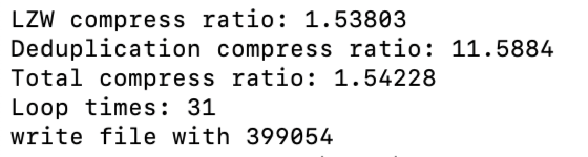

# Real-Time Ethernet Data Compression and Deduplication on Zynq UltraScale+ MPSoC

## Overview 
This project developed a high-speed, real-time data compression system using Vitis HLS on a Zynq Ultrascale+ MPSoC. The compression system involves content-defined chunking to break the input into chunks, SHA-256 hashes to screen for duplicated chunks, and LZW compression to compress non-duplicate chunks. 


The LZW module is a FPGA kernel implemented with Vitis HLS and deployed on a Zynq Ultrascale+ MPSoC. It is connected to AXI interfaces to interact with the Zynq MPSoC processing system, where CDC and SHA-256 modules are deployed as the host. To avoid bus contention and maximize bandwidth utilization, `multi_chunks` as input and `file_buffer` as output are assigned two independent AXI ports with 32-bit data width and 64-bit addressing space. This dual-port setting cooperates with dataflow and streaming, where FIFO buffers isolate the kernel into input initialization, lzw execution, and output finalization stages to support concurrent input/output and execution.     


To align with the ports allocation, `aximm1` as input and `aximm3` as output are mapped to `HP2_DDR_LOW` and `HP3_DDR_LOW` respectively. The Zynq Ultrascale+ MPSoC processing system interacts with the kernel by accessing the mapped addresses in DDR memory.  


When implemented on the Zynq Ultrascale SoC platform, 40,909 LUTs and 44,182 CLB registers are utilized, which respectively takes 58% and 31% of resources available on PL region. Almost 87% (216 tiles) of BRAM resources are utilized for implementing FIFO buffers to stream data between stages, and hash tables in LZW compression logic. Among the usage of LUTs, 20% of the LUTs are used as distributed memories due to extensive array partitions to support parallel accesses of memory banks. 


## Performance 

### Timing 
Under the operating frequency of 150 MHz, the compression system achieved a worst-case setup slack of 0.749 ns and a hold slack of 0.011 ns. The critical path involves communication between the logic in the `prefix_code_7_fu_556` module and the Block RAM (`ram_reg_bram_1`), which has 12 levels of logic and a fanout of 13. 


### Power
The system achieved 2.787W of power consumption when deployed on Zynq MPSoC, where dynamic and static power consumption contribute 2.464W and 0.323W respectively. If ignoring 70% power consumed by the Zynq MPSoC processing system, the PL region only consumes 0.176W, which suggests efficient logic synthesis and resource utilization. 


### Throughput 


### Compression ratio



*For the performance result, the left is on LittlePrince.txt and the right is on Franklin.txt

## Key Design Aspects

Our goal is to design a compressor that can receive data and compress it into memory using deduplication and compression. In this project, the input will be broken into chunks by using Content-Defined Chunking Algorithm. SHA-256 will be used to compute the hash value of each chunk, the hash value will later be the identification to determine whether to deduplicate the chunk or not. After SHA-256 computation, we use
associative memory to store the chunk content and its key value. Everytime the compressor receives a new chunk, check the hash map to see if this chunk is already in the associative memory. If not, the chunk will be sent to the LZW module to compress, if yes, the chunk will be deduplicated. Therefore, the repeated content of the input is removed while transmitting the data, the overall size of content to send is reduced.

## Parallelism

### Multiple Chunks in a Single Kernel, Loop Unrolling & Streaming

To make our kernel process lzw compression on multiple chunks concurrently, and lessen the times of host-device transfer. We fed multiple chunks in a single kernel. To achieve that, we use a linear buffer to load CHUNKS_IN_SINGLE_KERNEL chunks, wrap executing our initial LZW kernel implementation in a for loop, and return the file buffers for those chunks to be written also in a linear buffer.

```
void lzw_multi_chunks(unsigned char multi_chunks[CHUNKS_IN_SINGLE_KERNEL
* MAX_CHUNK_SIZE], int length[CHUNKS_IN_SINGLE_KERNEL], unsigned char
file_buffer[CHUNKS_IN_SINGLE_KERNEL * MAX_FILE_BUFFER_SIZE], int
total_bytes[CHUNKS_IN_SINGLE_KERNEL]){
. . . . . .
Main_loop_i: for(int i = 0; i < CHUNKS_IN_SINGLE_KERNEL; i++){
lzw(&multi_chunks[i * MAX_CHUNK_SIZE], length[i], file_buffer[i
* MAX_FILE_BUFFER_SIZE], total_bytes[i]);
}
. . . . . .
return;
```

To avoid memory allocation and address issues, we first create a two dimensional array to load the linear buffer, and another one to store the output code written into the encoded file. Since we transformed the linear buffer to two dimensional arrays, we can do array partitioning on the first dimension completely. The partitioned arrays then allow us to unroll the loop wrapping LZW execution, which enables all the chunks in the kernel to be processed in parallel.

```
void lzw_multi_chunks(unsigned char multi_chunks[CHUNKS_IN_SINGLE_KERNEL * MAX_CHUNK_SIZE], int length[CHUNKS_IN_SINGLE_KERNEL], unsigned char file_buffer[CHUNKS_IN_SINGLE_KERNEL * MAX_FILE_BUFFER_SIZE], int total_bytes[CHUNKS_IN_SINGLE_KERNEL]){
. . . . . .
unsigned char input_buffer[CHUNKS_IN_SINGLE_KERNEL][MAX_CHUNK_SIZE];
unsigned char output_buffer[CHUNKS_IN_SINGLE_KERNEL][MAX_FILE_BUFFER_SIZE];
#pragma HLS array_partition variable=input_buffer complete
#pragma HLS array_partition variable=output_buffer complete

Init_loop_i: for(int i = 0; i < CHUNKS_IN_SINGLE_KERNEL; i++){
Init_loop_j: for(int j = 0; j < length[i]; j++){
#pragma HLS pipeline II=1
input_buffer[i][j] = multi_chunks[i * MAX_CHUNK_SIZE + j];
}
}
Main_loop_i: for(int i = 0; i < CHUNKS_IN_SINGLE_KERNEL; i++){
#pragma HLS unroll
lzw(input_buffer[i], length[i], output_buffer[i], total_bytes + i);
}
Epi_loop_i: for(int i = 0; i < CHUNKS_IN_SINGLE_KERNEL; i++){
Epi_loop_j: for(int j = 0; j < total_bytes[i] + 4; j++){
#pragma HLS pipeline II=1
file_buffer[i * MAX_FILE_BUFFER_SIZE + j] = output_buffer[i][j];
}
}
```
After array partition and loop unrolling, we realize that the initialization and epilogue loops consume a lot of execution cycles but just copy data from one space to another. And we notice that the read, compute, and write step generate and consume data in the same sequential order. So we stream those three loops using hls::stream and dataflow pragma. The streamed operation enables read and write to be fully overlapped by LZW execution, thus without bringing extra latency to the kernel. Additionally, compared to the two dimensional array implementation, the depth of the FIFO is not constrained by the length of the array, thus reducing resource consumption. Our final design of the kernel is implemented as follows.

```
void lzw_multi_chunks(unsigned char multi_chunks[CHUNKS_IN_SINGLE_KERNEL * MAX_CHUNK_SIZE], int length[CHUNKS_IN_SINGLE_KERNEL], unsigned char file_buffer[CHUNKS_IN_SINGLE_KERNEL * MAX_FILE_BUFFER_SIZE], int total_bytes[CHUNKS_IN_SINGLE_KERNEL]){
#pragma HLS INTERFACE m_axi port=multi_chunks bundle=aximm1
#pragma HLS INTERFACE m_axi port=length bundle=aximm2
#pragma HLS INTERFACE m_axi port=file_buffer bundle=aximm3
#pragma HLS INTERFACE m_axi port=total_bytes bundle=aximm4
#pragma HLS dataflow
hls::stream<unsigned char> stream_input[CHUNKS_IN_SINGLE_KERNEL];
hls::stream<unsigned char> stream_output[CHUNKS_IN_SINGLE_KERNEL];
hls::stream<int> len_input[CHUNKS_IN_SINGLE_KERNEL];
hls::stream<int> len_output[CHUNKS_IN_SINGLE_KERNEL];
#pragma HLS stream variable=stream_input depth=250
#pragma HLS stream variable=stream_output depth=375
#pragma HLS stream variable=len_input depth=50
#pragma HLS stream variable=len_output depth=50
#pragma HLS array_partition variable=stream_input complete
#pragma HLS array_partition variable=stream_output complete
#pragma HLS array_partition variable=len_input complete
#pragma HLS array_partition variable=len_output complete
Init_loop_i: for(int i = 0; i < CHUNKS_IN_SINGLE_KERNEL; i++){
len_input[i].write(length[i]);
Init_loop_j: for(int j = 0; j < length[i]; j++){
#pragma HLS pipeline II=1
stream_input[i].write(multi_chunks[i * MAX_CHUNK_SIZE + j]);
}
}
Main_loop_i: for(int i = 0; i < CHUNKS_IN_SINGLE_KERNEL; i++){
#pragma HLS unroll
lzw(stream_input[i], len_input[i], stream_output[i], len_output[i]);
}
Epi_loop_i: for(int i = 0; i < CHUNKS_IN_SINGLE_KERNEL; i++){
total_bytes[i] = len_output[i].read();

Epi_loop_j: for(int j = 0; j < total_bytes[i] + 4; j++){
#pragma HLS pipeline II=1
file_buffer[i * MAX_FILE_BUFFER_SIZE + j] = stream_output[i].read();
}
}
return;
```

### Synchronization

After implementing the kernel to accept multiple chunks, the biggest problem is synchronization. That’s because chunks needed to be compressed by LZW are not coming consecutively. Duplicated chunks can appear during accumulating LZW chunks. To ensure those chunks to be successfully written into the encoded file in the right order, we use a vector to store deduplicated chunks while accumulating LZW chunks, and another vector to keep track of which category a certain chunk belongs to.

```
std::vector<std::array<unsigned char, 4>> dedup_file_buffer;
int dedup_offset = 0;
```

As shown in the code, lzw_or_dedup pushes back “false” for lzw chunks and “true” for deduplicated chunks, while dedup_file_buffer stores all the encountered deduplicated chunks as a size 4 unsigned char array. Dedup_offset keeps track of how many lzw chunks have been accumulated. The kernel begins to execute and write encoded file until dedup_offset reaches the target, CHUNKS_IN_SINGLE_KERNEL. The logic is shown as follows:

```
if(lzw_offset == CHUNKS_IN_SINGLE_KERNEL){
lzw_offset = 0;
Process multiple chunks in a single kernel
for(int i = 0; i < lzw_or_dedup.size(); i++){
if(!lzw_or_dedup[i]){
for(int j = 0; j < lzw_total_bytes[lzw_offset]; j++)
write_file(&lzw_file_buffer[lzw_offset * MAX_FILE_BUFFER_SIZE],
lzw_total_bytes[lzw_offset], "encoded.bin");
lzw_offset++;
}
else{
unsigned char write_temp[4];
std::memcpy(write_temp, dedup_file_buffer[dedup_offset].data(), 4);
write_file(write_temp, 0, "encoded.bin");
dedup_offset++;
}
}
lzw_offset = 0;
dedup_offset = 0;
lzw_or_dedup.clear();
dedup_file_buffer.clear();
```

It is worth noticing that at the end of processing all the chunks, the accumulated data
should be sent to the kernel even if lzw_offset doesn’t reach its target.

```
if(lzw_offset != 0){
Execute LZW and write encoded file
}
```

### Multiple Kernels
Compared with multiple chunks in a single kernel, multiple kernels achieve the same form of parallelism in different implementations. The logic of synchronization is also very similar. Instead of a single linear buffer, an array of buffers is used for different kernels. Chunks are enqueued and accessed in a circular way.

```
//create inputs for multiple kernels
memcpy(&lzw_chunks[lzw_offset % NUM_KERNELS][(lzw_offset / NUM_KERNELS) * MAX_CHUNK_SIZE], chunk_content, chunks[i].length());
lzw_chunks_length[lzw_offset % NUM_KERNELS][(lzw_offset / NUM_KERNELS)] = chunk_len;
//write outputs from multiple kernels into encoded file
for(int i = 0; i < lzw_or_dedup.size(); i++){
if(!lzw_or_dedup[i]){
write_file(&lzw_file_buffer[lzw_offset % NUM_KERNELS][(lzw_offset / NUM_KERNELS) * MAX_FILE_BUFFER_SIZE], lzw_total_bytes[lzw_offset % NUM_KERNELS][(lzw_offset / NUM_KERNELS)], "encoded.bin");
lzw_offset++;
}
```
To synchronize the command queue, vectors of events and event waitlists are used.

```
std::vector<cl::Event> write_events[NUM_KERNELS];
std::vector<cl::Event> exec_events[NUM_KERNELS];
cl::Event write_ev[NUM_KERNELS];
cl::Event exec_ev[NUM_KERNELS];
cl::Event read_ev[NUM_KERNELS];
for(int k = 0; k < NUM_KERNELS; k++){
q.enqueueMigrateMemObjects({lzw_chunks_bufs[k], lzw_chunks_length_bufs[k]}, 0 /*0 means from host*/, NULL, &write_ev[k]);
write_events[k].push_back(write_ev[k]);
}
printf("enqueue task\n");
for(int k = 0; k < NUM_KERNELS; k++){
q.enqueueTask(multi_kernels[k], &write_events[k], &exec_ev[k]);
exec_events[k].push_back(exec_ev[k]);
}
printf("Memory object migration enqueue host->device\n");
for(int k = 0; k < NUM_KERNELS; k++){
q.enqueueMigrateMemObjects({lzw_file_buffer_bufs[k], lzw_total_bytes_bufs[k]}, CL_MIGRATE_MEM_OBJECT_HOST, &exec_events[k], &read_ev[k]);
}
q.finish();
```

Each kernel only needs to synchronize with its own events. However, all commands are
required to be finished after each iteration of multiple kernel execution, right before
writing the encoded result into the file.

### Dataflow & Pipeline Hash Memory Initialization
Both the hash table and the associative memory should be initialized before the LZW execution starts. Since these two memories have no dependency upon each other while being set to 0, we wrap them using two functions, and use dataflow pragma to ensure they can run concurrently.

```
static void clear_mem(unsigned long *hash_table, assoc_mem* my_assoc_mem){
#pragma HLS DATAFLOW
clear_hash_table(hash_table);
clear_assoc_mem(my_assoc_mem);
}
```

Considering that the loop is very large, fully unrolling might cause a lot of resource utilization. We use a moderate pipeline instead, which will bring down the II from 3 to 1.

```
static void clear_assoc_mem(assoc_mem my_assoc_mem[512]){
my_assoc_mem->fill = 0;
for(int i = 0; i < 512; i++)
{
#pragma HLS pipeline
my_assoc_mem->upper_key_mem[i] = 0;
my_assoc_mem->middle_key_mem[i] = 0;
my_assoc_mem->lower_key_mem[i] = 0;
```

### Optimizing Associative Memory Lookup
In the initial design of associative memory lookup, matching the address needs 64 loop iterations which is not efficient:

```
for(; address < 64; address++)
if((match >> address) & 0x1) break;
```

To optimize addressing, we customize a function to find the address. A 64-bits target is partitioned into 8 segments to be processed concurrently. For each segment, 8 masks are generated in parallel so that the matching for each possibility can be executed in parallel, instead of sequentially in a for loop.

```
static unsigned int findAddr(uint64_t match){
#pragma HLS INLINE
if(match == 0) return 64; //find address failed
uint8_t segment[8]; // split 64-bits match into 8 x 8 bits
#pragma HLS array_partition variable=segment complete
// initialize all the segments in parallel
for(int i = 0; i < 8; i++){
#pragma HLS UNROLL
segment[i] = (match >> (8 * i)) & 0xFF;
}
uint8_t mask[8];
#pragma HLS array_partition variable=mask complete
for(int j = 0; j < 8; j++){
#pragma HLS UNROLL
mask[j] = 0x1 << j;
}
// check each segment in parallel
for(int i = 0; i < 8; i++){
#pragma HLS UNROLL
if(segment[i] != 0){
for(int j = 0; j < 8; j++){
#pragma HLS UNROLL
if(segment[i] & mask[j]){
return 8 * i + j;
}
}
}
}
return 64;
}
```

## Mapping to Zynq Resources

Different ports are assigned to ensure different kernels executing concurrently and not interfere with each other.


```
//initiating two kernels as an example
platform=u96v2_sbc_base
debug=1
save-temps=1
[connectivity]
nk=lzw_multi_chunks:2
sp=lzw_multi_chunks_1.multi_chunks:HP0
sp=lzw_multi_chunks_1.length:HP0
sp=lzw_multi_chunks_1.file_buffer:HP0
sp=lzw_multi_chunks_1.total_bytes:HP0
sp=lzw_multi_chunks_2.multi_chunks:HP1
sp=lzw_multi_chunks_2.length:HP1
sp=lzw_multi_chunks_2.file_buffer:HP1
sp=lzw_multi_chunks_2.total_bytes:HP1
```
